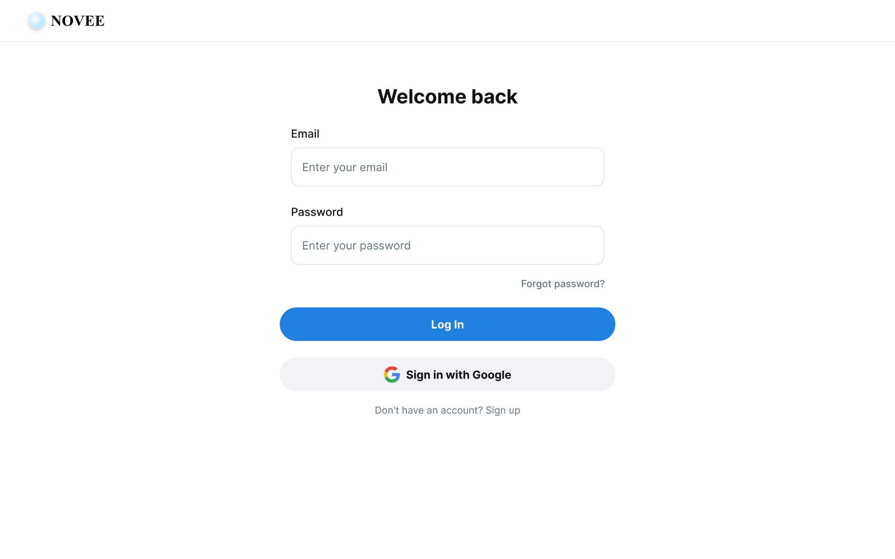
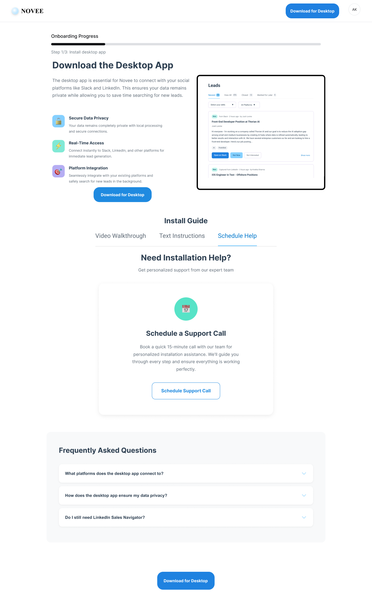
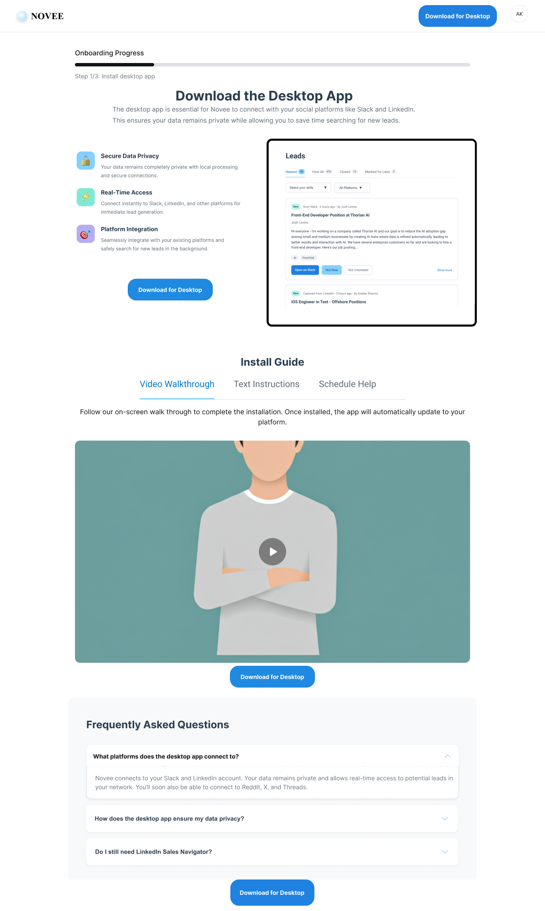
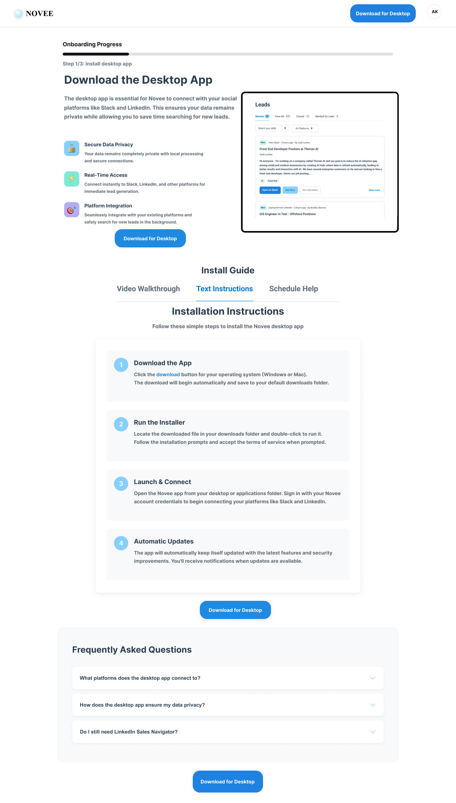
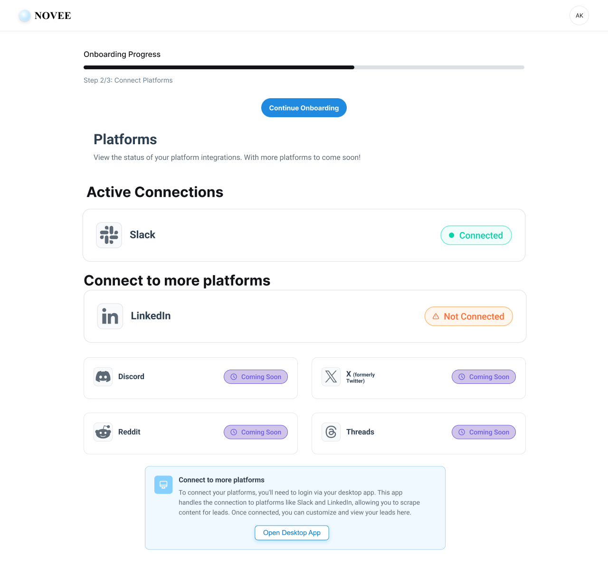
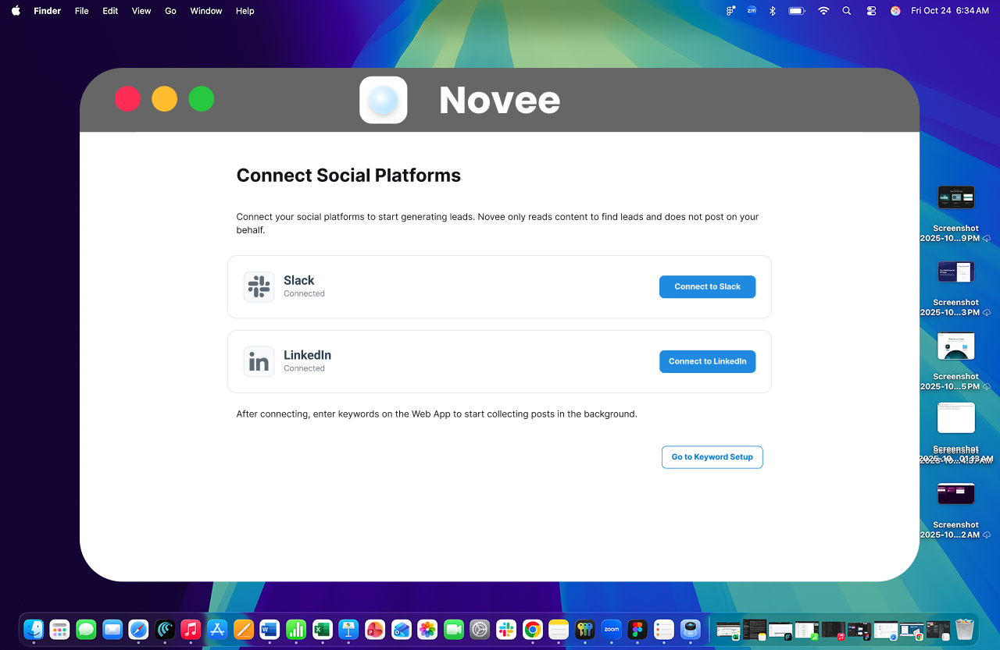
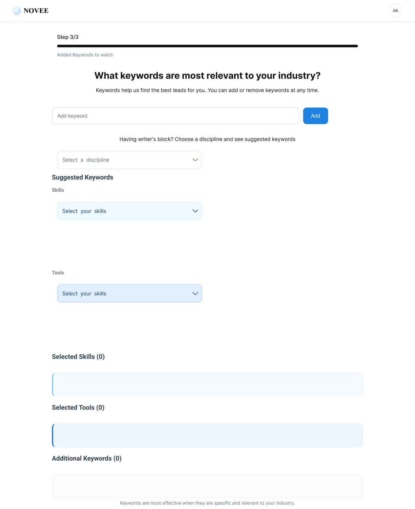
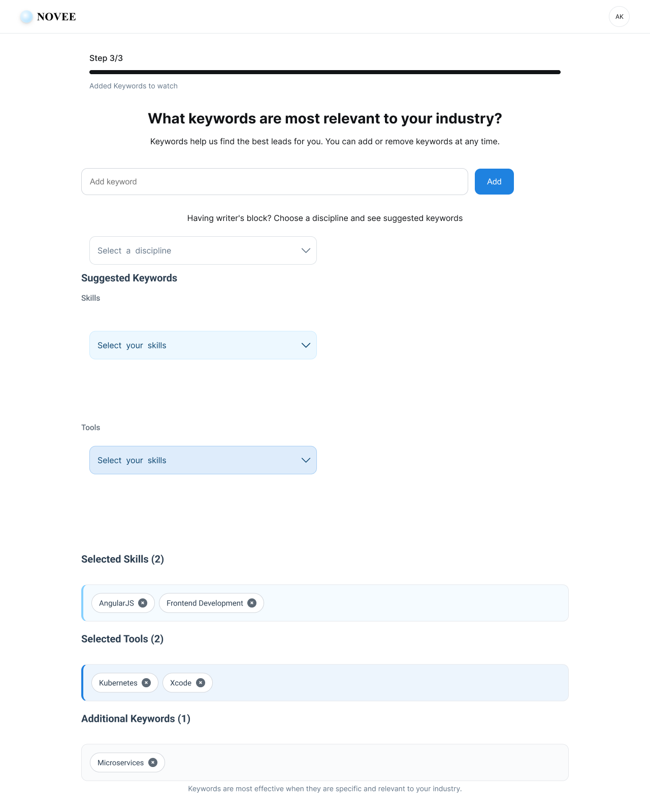
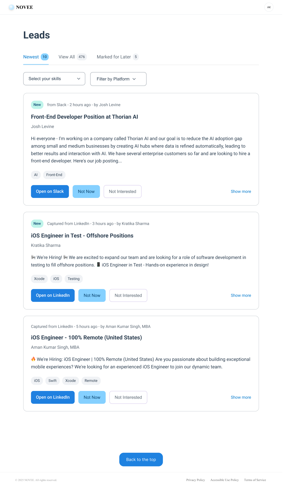

# 🧭 Novee Lead Gen – Ideal User Flow (MVP v1)

**Main Goal:** Get user from landing → signed in → desktop app installed → leads shown in web app

---

## 1a. Sign-Up (Web App)
**🎯 Goal:** Create an account via email/password or Google OAuth (Supabase Auth)

**Flow:**
- Sign up screen → name, email, password  
- Provides Google Auth with G icon button
- Post-sign-up: Redirect to Desktop App download screen

**Drop-offs:**
- Form friction or low motivation

✅ *Mitigation:* Keep form minimal + clear CTA ("Download App to Start Finding Leads")

## 1b. Login (Web App)
**🎯 Goal:** Login to your account via email/password or Google OAuth

**Flow:**
- Login screen → email, password or click Google Sign-In
- Provides Google Sign In with G icon button
- Post-login: Redirect to Leed Feed (if you have platform connections and keyword selections)
- Post-login: Redirect to Platform Connection Status (if you do not have platform connections)
- Post-login: Redirect to Keyword Selections (if you have platform connections but no keyword selections)

### Screen: Login

**Drop-offs:**
- Friction re-entering credentials if they just signed up
- Unclear visual hierarchy between email vs Google sign-in

✅ *Mitigation:*
- Offer password managers (browser autofill) + remember me pattern in future iterations
- Keep CTA button prominent and emphasize Google sign-in parity

### Screen: Login (Alt CTA Layout)

**Design Notes:**
- Variant places Google CTA beneath primary login for A/B testing or future experiments
- Keep copy in hero consistent across both layouts

---

## 2. Install Desktop App (Required)
**🎯 Goal:** Core to activation — the engine that scrapes lead content

**Flow:**
- Page explaining why local app is required (privacy, real-time access, avoids bans)
- Platform-detected download (Windows/Mac)
- Walkthrough: “Install → Login using your Novee account → Sign in to Slack in browser window inside app”
- Once Download has been clicked, show spinner, count down and redirect to Platform Connect Status page

✅ *Mitigation:*
- Include GIF/screenshots
- Add a "Need help?" link or minimal Troubleshooting Guide
- App shows real-time logs like: “Monitoring Slack channels…”

### Screen: Desktop App Download (Support Emphasis)

**Key Details:**
- Split hero with benefits list, download CTA, and onboarding progress indicator
- Secondary “Schedule Support Call” CTA for users needing hand-holding
- FAQ accordion reinforces privacy and integration messaging

### Screen: Desktop App Download (Video Walkthrough)

**Key Details:**
- Video walkthrough tab is primary to reduce install friction
- Maintain consistent FAQ anchors underneath

### Screen: Desktop App Download (Step-by-Step Instructions)

**Key Details:**
- Clear numbered steps for Windows/Mac to complement video support
- Reinforces benefits callouts and keeps FAQs accessible

---

## 2a. Platform Connection Status
**🎯 Goal:** Core to activation — they need to sign in to a platform using the desktop app

**Flow:**
- Page showing the platforms (Slack, LinkedIn, etc) and showing if we have live connections to scrape leads on these
- If no platforms are connected yet, they should see prompts on download, install and sign into platforms using the desktop app
- If platforms are connected, you can see status (Red, Green, Amber) and be prompted to fix any connection issues from the desktop app

**Drop-offs:**
- Users may not fully grasp that desktop is required to “connect” — especially if the platform cards are visible on web.

✅ *Mitigation:*
- Add a modal explanation only the first time:
  - “To connect platforms, please log into them from the Desktop App. This protects your privacy and bypasses platform restrictions.”

### Screen: Platform Connections Overview (WebApp)

**Key Details:**
- Progress indicator across onboarding steps keeps users oriented
- Shows Slack as connected, highlights upcoming integrations as “Coming Soon”
- Desktop download CTA remains available for users who skipped earlier step

---

## 3a. Login to Desktop App
**🎯 Goal:** Activate user's platform connections from the Desktop App

**Flow:**
- User signs into Novee using existing credentials

**Drop-offs:**
- User unsure why they need to login another time (on Desktop)

✅ *Mitigation:* 
- Show: "Connecting to your webapp and only need to login once"
  - Add note: “If you’re already signed in on the web, this connects your session.”

### Screen: Desktop Login

---

## 3b. Connect Social Platforms (via Desktop App)
**🎯 Goal:** User opens browser in the app and signs into Slack or LinkedIn, etc.

**Flow:**
- Shows you the various platforms supported by Novee and allows you to connect your credentials
- Displays status similar to the Platform Connection Status page
- User signs into Slack (or any supported platform) in the embedded browser
- Prompting the user to enter the Keywords on the Web App. Link them to Keyword
- App starts collecting posts in background (from all accessible public channels)

**No admin permissions or OAuth needed** — so smoother experience.

**Drop-offs:**
- User unsure what “connection” means

✅ *Mitigation:* 
- Show: “You’re in control. We never post. We only read content to help you find leads.”

**Drop-offs:**
- Showing too many platform options could create the illusion of support (e.g., LinkedIn) before it's functional.

✅ *Mitigation:*
- Use a “Coming Soon” badge on LinkedIn or Discord.
  - Or collapse into a + Add Platform button that first shows Slack.

### Screen: Connect Social Platforms (Desktop App)

**Key Details:**
- Emphasizes privacy: “Novee only reads content to find leads”
- Primary actions let user open Slack/LinkedIn auth flows quickly
- Clear follow-up CTA to proceed to keyword setup in the web app

---

## 4. Lead Discovery Setup (Web App)
**🎯 Goal:** Customize which posts should be surfaced as leads

**Flow:**
- Web app prompt: “Tell us what you’re looking for”
  - We can allow them to select a discipline and have suggested KWs for that
    - Populate pills of related KWs user can select and unselect
  - Onboarding for first time- Selects a high level KW or KWs 
  - We will not cap the number of KWs initially
- User will then save and move to Lead Feed
  - If onboarded, user can edit and add or remove KWs
- Option: “Skip for now”, takes you to empty Lead Feed

**Note:** Data only appears if Desktop App is running & logged in.

**Drop-off:**
- Too many keyword suggestions

✅ *Mitigation:* 
- Show top 5–7 first
- Add “Show more suggestions” collapsible section

**Drop-off:**
- Unclear what makes a good keyword

✅ *Mitigation:*
- Tooltip or helper text: “Keywords work best when they match how clients talk: roles, skills, or tools.”

### Screen: Keyword Setup (Empty State)

**Key Details:**
- Progress bar shows step 3/3 to encourage completion
- Encourages manual keyword entry plus suggestions by discipline, skills, and tools

### Screen: Keyword Setup (Populated)

**Key Details:**
- Pills show active selections and counts for transparency
- Helper copy reiterates “Keywords are most effective when…” to guide quality inputs

---

## 5. Dashboard – Lead Feed (Web App)
**🎯 Goal:** User sees relevant leads and feels the magic

**UI:**
- Card/grid layout of leads
- Each card includes:
  - Post snippet
  - Author
  - Source platform icon (Slack, Reddit, etc.)
  - Timestamp
  - Matched keyword(s)
  - “Open Source” → opens source post in new tab
- Empty States:
  - Show onboarding progress indicator: Platform Connected -> Keywords Selected -> Onboarded
    - Have links to visit onboarding screens 
    - Show 3–5 test/demo leads with tooltip: “These are example leads. Connect a platform + keywords to get real results.”
  - Or then if no Leads have been found provide estimated time for next scan
  

**Features:**
- Filters: Platform, Keyword
- Status: New / Archived
- Next scan time shown: “Next scan: in ~3 hrs”

**Drop-off:**
No leads = feels broken

✅ *Mitigation:*
Add:
→ “We didn’t find leads this cycle, but we’re checking every 24h.”
→ Show: last scrape timestamp, platform status (green/red), and next scan time

**Drop-off:**
- Leads too generic or old

✅ *Mitigation:*
- Weight latest posts first
- Consider showing 1–2 highlighted leads with label: “🔥 Hot Now”

### Screen: Lead Feed

**Key Details:**
- Tabbed filters for New, Viewed, Closed, and Marked for Later
- Lead cards highlight source platform, matched keywords, and actions (Interested, Not Interested, Open on platform)
- Footer includes accessibility and privacy links reinforcing trust

---

## ✅ User Activation Milestone
> “User has:  
> • Signed up  
> • Installed desktop app  
> • Signed into a platform (Slack)  
> • Added Keywords to watch
> • Seen 1+ real lead in dashboard”

---